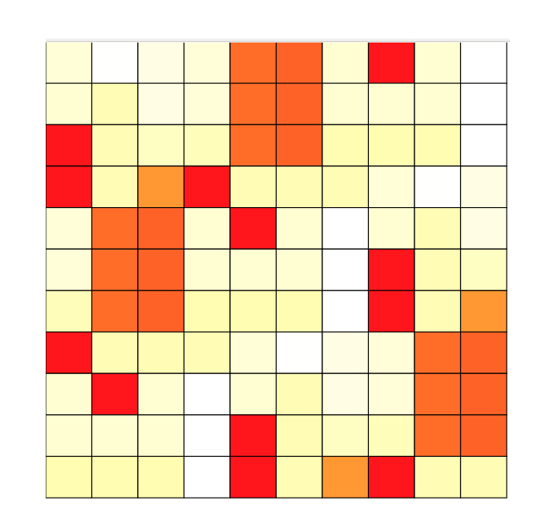

# Elm Heatmap



HTML-based [heatmap](https://en.wikipedia.org/wiki/Heat_map) in pure Elm.

The heatmaps allow you to display two-dimensional histogram data intuitively as a shading matrix. The buckets 
correspond to a matrix whose individual cells are colored according to the respective bucket value.

You can generate the Heatmap either from a list of lists of values or from a list of (row, column, value) - 
the first is intended to render well-populated heatmaps, the second for more sparse data (or data whose distribution 
is unknown).

You can configure:

* the number of rows and columns,
* the value range (adaptive or fixed) to determine the coloring,
* labels for the columns and rows,
* the color scheme,
* the color and message for cells with no data,
* whether cells show a message on mouse hover and
* whether cells get darker when hovered.

## Live Demo
See https://parquery.github.io/elm-heatmap/Basic.html

## Example
You can run the example from the Demo above on your machine by cloning the repository, running `elm-reactor` at the 
root and navigating into `examples/`.

## Installation
To install the package, run 

```elm-package install Parquery/elm-heatmap```


## Versioning
We follow [Semantic Versioning](https://semver.org/spec/v1.0.0.html). The version X.Y.Z indicates:

    X is the major version (backward-incompatible),
    Y is the minor version (backward-compatible), and
    Z is the patch version (backward-compatible bug fix).


## Development
Contributions to the package are welcome. To contribute, you need to:

1) fork the repository on GitHub, 
2) clone the fork to your local machine, 
3) create a branch,
4) push it to the fork, and
5) make a pull request on the upstream repository and send it for review.

Please run `precommit.sh` before creating a pull request.
